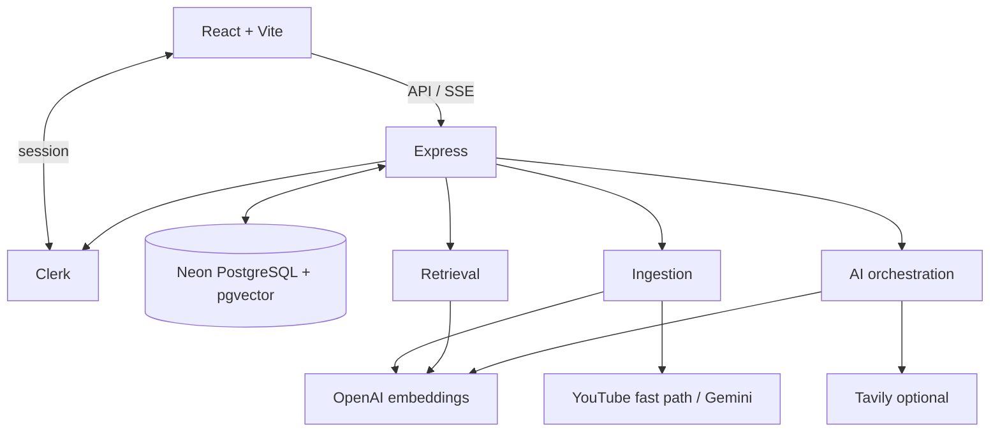
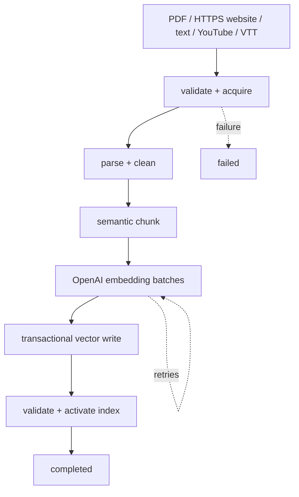
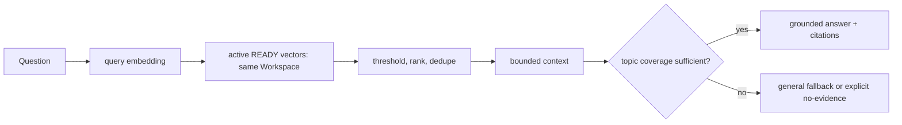
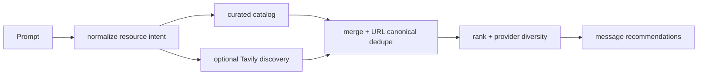

# Lumora Architecture

> Documentation snapshot — repository inspected 2026-08-16 at commit `07192bd`; diagrams describe IMPLEMENTED paths unless marked PLANNED.

## System overview

React/Vite provides the responsive web UI; Express is the authenticated API; Clerk provides identity; Prisma persists data in Neon PostgreSQL with pgvector; OpenAI supplies embeddings/configured chat; Tavily is optional for web intelligence. Three.js is limited to the landing page.



## Isolation and persistence

**IMPLEMENTED:** `Workspace.userId` is the ownership anchor. Sources, content, processing attempts, indexes, chunks, messages, and citations associate with it. Protected routes authenticate and verify ownership before nested operations. Retrieval rejects candidates outside the requested Workspace or active READY index, with mismatched source version or embedding contract.

`SourceIndex` is versioned; transactional validation completes before `Source.activeIndexId` changes. Citation rows preserve source/index/chunk provenance.

## Ingestion and retrieval



**IMPLEMENTED:** parsers preserve page/timestamp/source provenance. Chunking targets 1,200 characters (~300 estimated English tokens), overlaps 200 characters, and has a 100-character minimum. OpenAI embeddings are 1,536-dimensional, batch up to 64 inputs, timeout at 30 seconds, and retry transient failures up to three times.

**IMPLEMENTED — YouTube acquisition:** when a proxy is configured, Lumora tries its authenticated transcript fast path once. It validates cue data; unavailable, empty, malformed, blocked, or transient fast-path results fall back to Gemini-native acquisition. Gemini obtains structured transcript segments; unavailable/no-speech outcomes are surfaced explicitly. This is an acquisition fallback, not a claim that every video is ingestible.



Retrieval defaults to five results, threshold 0.15, and a 3,500-token context budget. A deterministic evidence gate requires each distinctive requested topic group to appear in retrieved source text.

## Generation and resource intelligence

**IMPLEMENTED:** SSE streaming, durable message/citation lifecycle handling, up to four tool rounds, validated tool attribution, and aggregation of reported provider usage. Document and web citations are distinct.



Discovery has a bounded cache and fails closed to curated content. Search metadata cannot establish a price, so unknown availability is not labeled free.

## Usage and cost observability

```mermaid
sequenceDiagram
 User->>API: metered action
 API->>DB: advisory lock + PENDING reservation
 DB-->>API: allowed / limit
 API->>API: perform work
 API->>DB: COMMIT usage or discard
 Note over DB: committed window is 24h; stale pending expires after 5m
```

**IMPLEMENTED:** `UsageEvent` can persist provider, model, input tokens, output tokens, and estimated model cost when reported usage maps to the configured repository pricing constants. This is backend event-level observability. It is **not** customer billing, an admin finance dashboard, invoice reconciliation, or token-priced Usage enforcement. The constants are **CONFIGURED COST-ESTIMATION CONSTANTS IN THE REPOSITORY**, not guaranteed current provider prices, and should be updated when provider pricing changes.

Aggregate cost analytics, customer lifetime token dashboards, and finance dashboards are **PLANNED**.

## Deployment and tradeoffs

**IMPLEMENTED:** Vite assets and bundled Express output go to `dist`; `vercel.json` provides a protected transcript relay and rewrites API traffic to Render. `/api/health` validates PostgreSQL and pgvector. Database-backed claims and bounded recovery avoid treating memory as a durable queue. Pgvector keeps ownership and vectors close; fixed `vector(1536)` buys integrity at the cost of embedding-dimension flexibility. Rolling limits are enforceable action caps, not token-priced billing.
